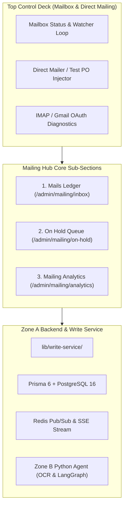

# Kiran-OS — Mailing Hub Architecture & Implementation Spec (`WORKING.md`)

> **Target Audience:** Claude Code / Engineering Team  
> **Goal:** Create and deploy the unified **Mailing Hub** under `/admin/mailing` (and `/admin/mail`) in the existing Kiran-OS Lite / OrderOps AI application.  
> **Guiding Principle:** **"The Working, Not the Style"** — Focus on deterministic backend logic, strict write-service boundaries, reliable state machines, robust API contracts, and real-time operational workflows.

---

## 1. System Overview & Architecture

The **Mailing Hub** elevates Kiran-OS from a passive email watcher into an end-to-end communication and intake command center. It unifies inbound stream monitoring, document triage, quarantined/on-hold order resolution, direct outbound PO injection, and performance analytics into a single cohesive interface.



### Core Non-Negotiable Rules (from `CLAUDE.md`)
1. **Write Service Monopoly:** `lib/write-service/` is the sole authority permitted to write canonical tables (`Order`, `OrderVersion`, `AsnAllocation`, `OrderApproval`, `ExceptionItem`, `EmailLog`, `AcknowledgementLog`). Route handlers and controllers must **never** call `prisma.<entity>.create/update/delete` directly.
2. **Zero DELETE Policy:** Canonical tables are strictly append-only or archived via `isArchived = true`. Soft-state sentinels must be used for disconnections or cancellations.
3. **Idempotent Ingestion:** Deduplication via `EmailLog.messageId` and `SourceDocument.sha256` ensures identical messages or forwarded attachments are never processed twice.
4. **Provenance & Evidence:** Every extracted fact maintains coordinates `{page, bbox, snippet, confidence}`. Any value lacking source text evidence is penalized to `confidence = 0.0`.

---

## 2. Structural Layout & Route Architecture

The section is organized under the admin operations group:

```
apps/web/src/app/(ops)/admin/
├── mailing/
│   ├── layout.tsx                # Shared layout hosting the Top Control Deck & Tab Navigation
│   ├── page.tsx                  # Redirects to /admin/mailing/inbox
│   ├── inbox/
│   │   └── page.tsx              # "The Mails Part" — Inbound & Outbound email audit ledger
│   ├── on-hold/
│   │   ├── page.tsx              # "The On Hold Part" — Quarantined & exception triage queue
│   │   └── [id]/page.tsx         # Detailed side-by-side on-hold resolver & PDF viewer
│   └── analytics/
│       └── page.tsx              # "The Analytics Part" — Operational intake & latency metrics
└── _components/
    ├── mailing-control-deck.tsx  # Direct mailing, sync triggers, and connection status
    ├── mails-table.tsx           # Paginated email stream with status badges
    ├── mail-inspector.tsx        # MIME body, headers, and attachment previews
    ├── on-hold-table.tsx         # Triage matrix for filtered/exception items
    ├── on-hold-resolver.tsx      # Extraction comparison, snippet highlighter, inline editor
    └── mailing-analytics-charts.tsx # Visual volume, classification & SLA breakdowns
```

---

## 3. Detailed Sub-Section Specifications

### 3.1. Top Control Deck: Mailbox & Direct Mailing (Over-Top Part)

The top deck acts as a persistent toolbar across all mailing sub-routes:

* **Live Connection Monitor:**
  * Real-time indicator for IMAP watcher / Gmail PubSub status (Poll heartbeat, Last error, Last checked time).
  * Quick-actions: `[Run Poll Now]`, `[Pause / Resume Monitor]`, `[Connection Settings]`.
* **Direct Mailing / PO Injector:**
  * Allows operators to manually dispatch test POs or ingest raw MIME/PDF payloads without an external email client.
  * Inputs: Sender Email, Target Recipient, Subject, Email Body, and PDF Attachment upload.
  * Flow: Validates file signature (`pdf-lib`), stores file in object storage (`lib/storage`), writes `EmailLog` & `SourceDocument`, and queues an `IngestJob` directly into Zone B / Demo Pipeline.

### 3.2. Sub-Section 1: "The Mails Part" (`/admin/mailing/inbox`)

A complete operational audit ledger of all mail interactions.

* **List View:**
  * Columns: Status Chip, Sender Address, Subject, Received Timestamp, Attachments Count, Linked Order / ASN, Acknowledgement State.
  * Search & Filters: Filter by Status (`RECEIVED`, `CLASSIFIED`, `EXTRACTING`, `VALIDATED`, `COMMITTED`, `NOT_AN_ORDER`, `EXCEPTION`, `ACKNOWLEDGED`), Date range, Customer domain, or Free-text search.
* **Split Message Inspector:**
  * **Header Panel:** From, To, Date, Message-ID, SPF/DKIM/DMARC authentication results.
  * **Body Viewer:** Rendered plain-text / sanitized HTML body.
  * **Attachment Tray:** List of attachments with MIME badges, SHA-256 hashes, OCR status, and inline PDF preview.
  * **Lifecycle Timeline:** Step-by-step audit log showing intake filter -> classification -> extraction -> approval -> acknowledgement send.

### 3.3. Sub-Section 2: "The On Hold Part" (`/admin/mailing/on-hold`)

The central quarantine and triage cockpit for everything requiring human intervention.

* **Classification of On-Hold Items:**
  1. **Intake Filtered:** Emails from unknown sender domains or missing order markers (marked `NOT_AN_ORDER` or `FAILED`).
  2. **Extraction Exceptions (`ExceptionItem`):** Low model confidence (< 0.85), ambiguous PO dates, duplicate PO numbers, unmapped products/locations.
  3. **Human Approval Gate (`OrderApproval`):** Validated orders held for mandatory reviewer sign-off prior to canonical database commit (ADR-0005).
* **Triage Workflows & Actions:**
  * **Release & Commit As Edited:** Operator modifies extraction values inline; writes changes to `OrderApproval.correctedJson` or `ExceptionItem.proposedJson`, transitions `IngestJob` to `COMMITTED`, generates canonical `Order` + `OrderVersion`, allocates `ASN`, and triggers customer ACK.
  * **Whitelist & Ingest:** Adds the sender domain to `CompanyDomain` reference data, assigns target company, and automatically re-triggers extraction pipeline.
  * **Discard / Reject:** Closes item with mandatory `decisionNote` audit log without touching canonical order tables.
  * **Re-extract:** Re-queues the existing `SourceDocument` to Zone B with refreshed prompt parameters or higher OCR resolution.

### 3.4. Sub-Section 3: "The Analytics Part" (`/admin/mailing/analytics`)

Real-time business intelligence and pipeline health telemetry.

* **Key Performance Metrics:**
  * **Intake Velocity:** Total emails processed, breakdown of Orders vs Inquiries vs Noise.
  * **Straight-Through Processing (STP) Rate:** Percentage of orders committed automatically without manual exception triage.
  * **Turnaround Latency:** End-to-end duration from email receipt to ACK dispatch (p50, p90, p99).
  * **Exception Pareto Analysis:** Distribution of hold causes (Unknown Domain, Ambiguous Date, Low Confidence, OCR failure).
  * **Sender Volume Leaders:** Top customer domains generating PO traffic and their error frequencies.
  * **SLA Compliance:** Acknowledgment dispatch latency vs target (< 15 mins).

---

## 4. Backend Contracts & Write-Service Methods

All database mutations must be implemented inside `apps/web/src/lib/write-service/`:

### 4.1. Write-Service Signatures (`apps/web/src/lib/write-service/mailing.ts`)

```typescript
import { PrismaClient } from "@prisma/client";

export interface DirectMailInput {
  organizationId: string;
  fromAddress: string;
  toAddress: string;
  subject: string;
  bodyText: string;
  attachments: Array<{
    filename: string;
    mimeType: string;
    buffer: Buffer;
  }>;
  actor: string;
}

export interface ResolveOnHoldInput {
  organizationId: string;
  ingestJobId: string;
  action: "COMMIT_EDITED" | "REJECT" | "RETRY_EXTRACTION";
  correctedData?: Record<string, unknown>;
  reason?: string;
  actorUserId: string;
}

export interface WhitelistDomainInput {
  organizationId: string;
  companyId: string;
  domain: string;
  ingestJobId?: string;
  actorUserId: string;
}

/** Ingests a manual or direct email dispatch and kicks off the processing graph */
export async function injectDirectEmail(
  prisma: PrismaClient,
  input: DirectMailInput
): Promise<{ emailLogId: string; ingestJobId: string }>;

/** Resolves an on-hold order or exception item with full audit logging */
export async function resolveOnHoldItem(
  prisma: PrismaClient,
  input: ResolveOnHoldInput
): Promise<{ success: boolean; orderId?: string }>;

/** Whitelists a new sender domain and optionally re-runs pending intake jobs */
export async function whitelistDomainAndReingest(
  prisma: PrismaClient,
  input: WhitelistDomainInput
): Promise<{ companyDomainId: string; reprocessedCount: number }>;
```

---

## 5. API Route Endpoints

| Route | Method | Purpose | Response Payload |
| :--- | :--- | :--- | :--- |
| `/api/admin/mailing/summary` | `GET` | Aggregated badge counters for Mails, On Hold & Health | `{ totalMails, onHoldCount, stpRate, monitorStatus }` |
| `/api/admin/mailing/mails` | `GET` | Paginated email logs with filters | `{ items: ApiEmailLog[], total, page, pageSize }` |
| `/api/admin/mailing/mails/[id]` | `GET` | Detailed email with body, headers, attachments & stages | `{ email: ApiEmailDetail }` |
| `/api/admin/mailing/on-hold` | `GET` | Quarantined orders and exception items | `{ items: ApiOnHoldItem[], total }` |
| `/api/admin/mailing/on-hold/[id]/resolve` | `POST` | Execute triage decision (Commit, Reject, Whitelist) | `{ success: true, orderId?: string }` |
| `/api/admin/mailing/direct-send` | `POST` | Inject direct / test email into pipeline | `{ emailLogId, ingestJobId, status }` |
| `/api/admin/mailing/analytics` | `GET` | Time-series data, error distributions & STP rates | `{ timeseries, errorBreakdown, domainStats, slas }` |

---

## 6. Implementation Task Checklist for Claude Code

### Step 1: Backend & Write Service
- [ ] Create `apps/web/src/lib/write-service/mailing.ts` implementing `injectDirectEmail`, `resolveOnHoldItem`, and `whitelistDomainAndReingest`.
- [ ] Add unit tests in `apps/web/src/lib/write-service/mailing.test.ts` proving zero canonical delete, atomic commits, and audit log generation.
- [ ] Create API route handlers under `apps/web/src/app/api/admin/mailing/` with role validation (`orion_app`).

### Step 2: Top Deck & Shared Layout
- [ ] Create `apps/web/src/app/(ops)/admin/mailing/layout.tsx` incorporating `MailingControlDeck` and sub-navigation tabs (`Mails`, `On Hold`, `Analytics`).
- [ ] Update `apps/web/src/app/(ops)/ops-sidebar.tsx` to link to `/admin/mailing` with dynamic count badge for `onHold`.

### Step 3: Mails Sub-Section
- [ ] Implement `apps/web/src/app/(ops)/admin/mailing/inbox/page.tsx`.
- [ ] Build `MailsTable` with search filters, status chips, and pagination.
- [ ] Build `MailInspector` showing headers, plain text, and PDF attachments via `pdfjs-dist`.

### Step 4: On Hold Sub-Section
- [ ] Implement `apps/web/src/app/(ops)/admin/mailing/on-hold/page.tsx`.
- [ ] Build `OnHoldTable` grouping items by hold reason (`INTAKE_FILTERED`, `EXCEPTION`, `AWAITING_APPROVAL`).
- [ ] Implement `OnHoldResolver` providing side-by-side comparison, bounding-box evidence inspection, and inline field editing.

### Step 5: Analytics Sub-Section
- [ ] Implement `apps/web/src/app/(ops)/admin/mailing/analytics/page.tsx`.
- [ ] Build KPI stat cards and interactive charts for intake volume, classification ratios, and pipeline processing latency.

### Step 6: Verification & Test Suite
- [ ] Run `pnpm --filter web test` and ensure 100% test pass rate.
- [ ] Verify build with `pnpm --filter web typecheck` and `pnpm --filter web lint`.
